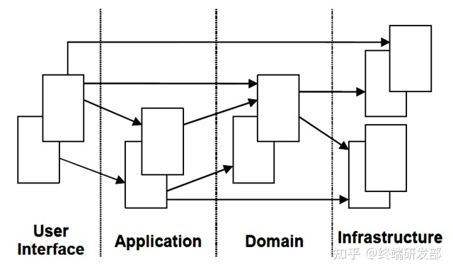

### 实体
> 实体就是领域中需要唯一标识的领域概念
### 值对象
> 值对象没有唯一标识，这是它和实体的最大不同。
<!-- more -->
### 领域服务
> 1. 领域中的一些概念不太适合建模为对象，即归类到实体对象或值对象，因为它们本质上就是一些操作，一些动作，而不是事物。
> 这些操作或动作往往会涉及到多个领域对象，并且需要协调这些领域对象共同完成这个操作或动作。
> 2. 一般的领域对象都是有状态和行为的，而领域服务没有状态只有行为;需要强调的是领域服务是无状态的，它存在的意义就是协调领域对象共完成某个操作，所有的状态还是都保存在相应的领域对象中。
### 聚合及聚合根（Aggregate，Aggregate Root）
> 1. 从业务的角度深入分析哪些对象它们的**关系是内聚****的**，即我们会把他们看成是一个整体来考虑的；然后这些对象我们就可以把它们放在一个聚合内。
> 2. 所谓关系是内聚的，**是指这些对象之间必须保持一个固定规则**，固定规则是指在数据变化时必须保持不变的一致性规则。当我们在修改一个聚合时，我们必须在事务级别确保整个聚合内的所有对象满足这个固定规则。
* 聚合有以下一些特点：
    * **每个聚合有一个根和一个边界**，**边界定义了一个聚合内部有哪些实体或值对象，根是聚合内的某个实体**；
    * 聚合内部的对象之间可以相互引用，但是聚合外部如果要访问聚合内部的对象时，必须通过聚合根开始导航，绝对不能绕过聚合根直接访问聚合内的对象，**也就是说聚合根是外部可以保持 对它的引用的唯一元素**；
    * 聚合内除根以外的其他实体的唯一标识都是本地标识，也就是只要在聚合内部保持唯一即可，因为它们总是从属于这个聚合的；
    * **聚合根负责与外部其他对象打交道并维护自己内部的业务规则**；
    * 基于聚合的以上概念，我们可以推论出从数据库查询时的单元也是以聚合为一个单元，也就是说我们不能直接查询聚合内部的某个非根的对象；
    * 聚合内部的对象可以保持对其他聚合根的引用；
    * 删除一个聚合根时必须同时删除该聚合内的所有相关对象，因为他们都同属于一个聚合，是一个完整的概念；

* 有分析报告显示，通常在大部分领域模型中，有70%的聚合通常只有一个实体，即聚合根，该实体内部没有包含其他实体，只包含一些值对象；另外30%的聚合中，基本上也只包含两到三个实体。这意味着大部分的聚合都只是一个实体，该实体同时也是聚合根。 

### 工厂
> 封装创建复杂对象的细节

### 仓储
> 1. 管理对象
> 2. 仓储里面存放的对象一定是聚合，原因是之前提到的领域模型中是以聚合的概念去划分边界的；
> 3. 仓储还有一个重要的特征就是分为仓储定义部分和仓储实现部分，在领域模型中我们定义仓储的接口，而在基础设施层实现具体的仓储。
> 4. 不负责事务处理

### 工作单元
>  负责事务处理

### 设计领域模型的一般步骤
1. 根据需求建立一个初步的领域模型，**识别出一些明显的领域概念以及它们的关联**，关联可以暂时没有方向但需要有（1：1，1：N，M：N）这些关系；可以用文字精确的没有歧义的描述出每个领域概念的涵义以及包含的主要信息；
2. **分析主要的软件应用程序功能，识别出主要的应用层的类**；这样有助于及早发现哪些是应用层的职责，哪些是领域层的职责；
3. 进一步分析领域模型，**识别出哪些是实体，哪些是值对象，哪些是领域服务**；
4. 分析关联，通过对业务的更深入分析以及各种软件设计原则及性能方面的权衡，**明确关联的方向或者去掉一些不需要的关联**；
5. **找出聚合边界及聚合根**，这是一件很有难度的事情；因为你在分析的过程中往往会碰到很多模棱两可的难以清晰判断的选择问题，所以，需要我们平时一些分析经验的积累才能找出正确的聚合根；
6. 为聚合根配备仓储，**一般情况下是为一个聚合分配一个仓储**，此时只要设计好仓储的接口即可；
7. 走查场景，**确定我们设计的领域模型能够有效地解决业务需求**；
8. **考虑如何创建领域实体或值对象，是通过工厂还是直接通过构造函数**；
9. **停下来重构模型**。寻找模型中觉得有些疑问或者是蹩脚的地方，比如思考一些对象应该通过关联导航得到还是应该从仓储获取？聚合设计的是否正确？考虑模型的性能怎样，等等；

### CQRS架构
> 核心思想是将应用程序的查询部分和命令部分完全分离，这两部分可以用完全不同的模型和技术去实现。比如命令部分可以通过领域驱动设计来实现；查询部分可以直接用最快的非面向对象的方式去实现，比如用SQL。这样的思想有很多好处：

1. 实现命令部分的领域模型不用经常为了领域对象可能会被如何查询而做一些折中处理；
2. 由于命令和查询是完全分离的，所以这两部分可以用不同的技术架构实现，包括数据库设计都可以分开设计，每一部分可以充分发挥其长处；
3. 高性能，命令端因为没有返回值，可以像消息队列一样接受命令，放在队列中，慢慢处理；处理完后，可以通过异步的方式通知查询端，这样查询端可以做数据同步的处理；

### 四色原型分析模式
用一句话来概括四色原型就是：一个什么什么样的人或组织或物品以某种角色在某个时刻或某段时间内参与某个活动。 
其中“什么什么样的”就是DESC，“人或组织或物品”就是PPT，“角色”就是Role，而”某个时刻或某段时间内的某个活动"就是MI。

### 参考
https://zhuanlan.zhihu.com/p/361427612